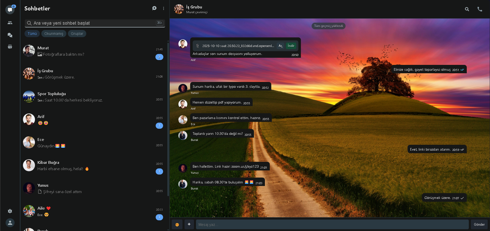
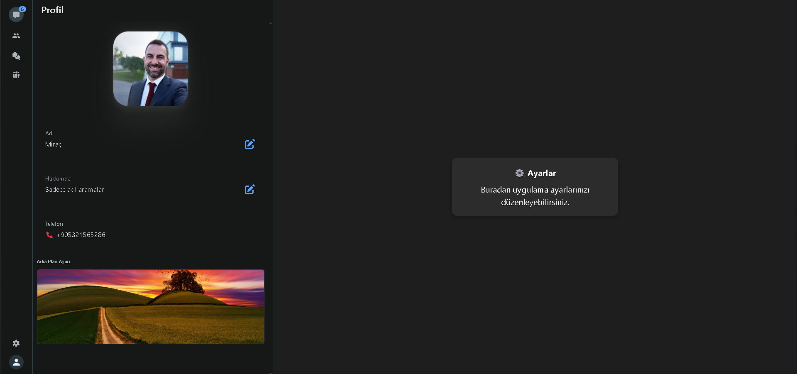
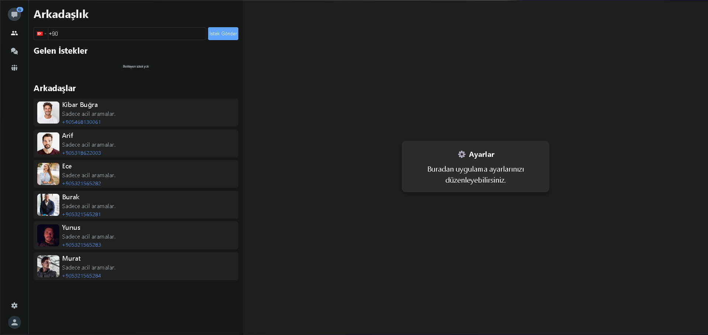

# Scriber Chat App

Modern, gercek zamanli mesajlasma ve cagri altyapisi sunan full-stack sohbet uygulamasi.


## Preview





## Ozellikler

- Gercek zamanli birebir ve grup mesajlasma
- Socket.IO ile anlik olaylar (mesaj, durum, etkilesim)
- Mesaj durumlari (gonderildi, iletildi, okundu) yonetimi
- Arkadaslik sistemi ve gelen/giden istek akisi
- Kimlik dogrulama, e-posta dogrulama ve sifre yenileme
- Profil, arka plan ve medya yukleme akislari
- Cagri altyapisi ve `call/:callId` rotasi ile gorusme deneyimi

## Teknoloji Yigini

### Frontend (`Chat_Project`)

- React 18 + Vite
- Redux Toolkit + Redux Persist
- React Router
- Socket.IO Client
- Sass / CSS
- Material UI + React Icons

### Backend (`Chat_Backend`)

- Node.js + Express
- Socket.IO
- MongoDB + Mongoose
- JWT + bcrypt
- Redis (`ioredis`)
- AWS S3 (presigned URL) + Sharp
- Nodemailer (mail dogrulama/sifre akislari)

## Proje Yapisi

```text
Chat_App/
├─ Chat_Project/   # React + Vite frontend
└─ Chat_Backend/   # Express + Socket.IO backend
```

## Kurulum

### 1) Depoyu klonlayin

```bash
git clone <repo-url>
cd Chat_App
```

### 2) Bagimliliklari yukleyin

```bash
cd Chat_Project && npm install
cd ../Chat_Backend && npm install
```

### 3) Ortam degiskenlerini tanimlayin

Frontend icin (`Chat_Project/.env`):

```env
VITE_BACKEND_URL=http://localhost:5000
VITE_BACKEND_SOCKET_URL=http://localhost:3500
```

Backend icin (`Chat_Backend/.env`) gerekli temel anahtarlar:

```env
PORT=5000
SOCKET_PORT=3500
BACKEND_URL=http://localhost:5000
JWT_SECRET=your_secret
DB_USERNAME=your_mongo_username
DB_PASSWORD=your_mongo_password
REDIS_URL=redis://localhost:6379
AWS_REGION=...
AWS_ACCESS_KEY=...
AWS_SECRET_KEY=...
AWS_BUCKET_NAME=...
MAILER_SERVICE=...
MAILER_MAIL=...
MAILER_CLIENT_ID=...
MAILER_CLIENT_SECRET=...
MAILER_REFRESH_TOKEN=...
```

## Calistirma

Backend terminali:

```bash
cd Chat_Backend
npm run start
```

Socket sunucusu (ayri terminal):

```bash
cd Chat_Backend
npm run socket
```

Frontend terminali:

```bash
cd Chat_Project
npm run dev
```

## Scriptler

### Frontend (`Chat_Project`)

- `npm run dev` - gelistirme sunucusu
- `npm run build` - production build
- `npm run preview` - build onizleme
- `npm run lint` - ESLint kontrolu
- `npm run sass` - Sass izleme

### Backend (`Chat_Backend`)

- `npm run start` - Express API (nodemon)
- `npm run socket` - Socket server (nodemon)

## Yol Haritasi

- [ ] Uctan uca sifreleme
- [ ] Gelismis bildirim merkezi
- [ ] Cagri deneyiminde ek medya kontrolleri
- [ ] Test kapsamini artirma (unit + integration)

## Katki

Katki yapmak icin issue acabilir veya pull request gonderebilirsin.

1. Fork al
2. Yeni bir branch ac (`feature/your-feature`)
3. Commitlerini ekle
4. PR olustur

## Lisans

Bu proje MIT lisansi altinda sunulmaktadir.